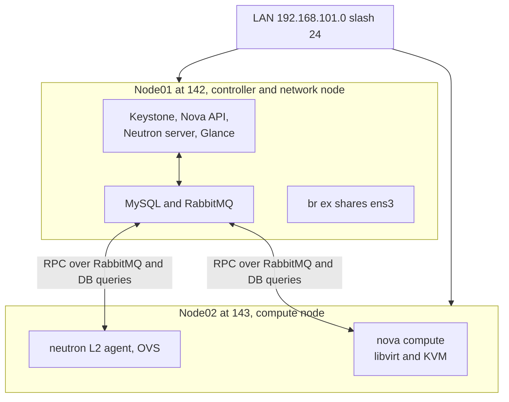

# OpenStack DevStack Lab: Overview and Architecture

## Running OpenStack on two 4GB VMs. Here is what actually happened.

Most OpenStack tutorials assume a beefy server with 16GB of RAM and a fast NVMe drive sitting around. That was not available here. What was available: two Ubuntu 24.04 VMs, 4GB of RAM each, 60GB of disk, sitting in a homelab. The question was whether a multi node OpenStack environment could actually run on hardware this modest, just to understand how the pieces fit together.

Short answer, yes, but it is not going to be pleasant, and there is more to learn from the things that break than from the things that work.

## Why bother with something this underpowered

There is a difference between operating something someone else built and actually watching it come together from nothing. The gap between running openstack server list and understanding why nova conductor talks to RabbitMQ before it talks to the database is bigger than it looks. A cramped lab forces real understanding of what each service is doing, because there is no resource headroom to skip past it.

## The setup

Two nodes, same LAN, same subnet.

| Node | Hostname | IP | Role |
|---|---|---|---|
| Node 1 | ab lab research 01 | 192.168.101.142 | Controller and network node |
| Node 2 | ab lab research 02 | 192.168.101.143 | Compute node |

Both run Ubuntu 24.04.4 LTS, a single NIC each (ens3), and no separate interface for provider networking. That last detail matters more than it sounds. A lot of OpenStack guides assume a spare NIC is available for the external bridge. There was not one here, so br ex had to share the same physical interface as the management network.

For the deployment tool, this went with DevStack instead of Kolla ansible or a manual RDO style install. DevStack is not meant for production. It is explicitly a dev and test tool, source installed through git and pip, restarted by hand rather than managed by systemd the way you would expect. That is exactly why it works well for learning. When something breaks, what shows up is a Python traceback from the actual service code, not a container log three abstraction layers removed from the problem.

## Architecture

Node02 does not make decisions on its own. Scheduling and network planning live entirely on node01. Node02 just executes what it is told. It spins up a VM through libvirt when Nova says so, and wires up a port when Neutron says so. There is no SSH between the nodes anywhere in this flow. Everything travels over RabbitMQ and direct MySQL connections, using the host and service variables set in each node config (covered on the Prerequisites and Installation pages).

## Role split rationale

With only two nodes and this little headroom, there is really one sane split. Node01 carries everything control plane related, Keystone, Nova API, Neutron server, Glance, MySQL, RabbitMQ, plus acting as the network node for br ex. Node02 stays lean, running only nova compute and the neutron L2 agent.

This is not a load balancing decision, it is survival. Putting API services on both nodes would mean fighting over the same scarce 4GB twice instead of once.

## Networking without a spare NIC

Since both nodes only have ens3, the external network has to live on the same physical link as management traffic. The practical answer is carving out a small unused range from the existing subnet for floating IPs, a slash 28 block that was not handed out to anything else, and pointing FLOATING_RANGE and PUBLIC_INTERFACE at that. br ex gets built on top of ens3 instead of a dedicated interface. It is not how this would be architected for anything real, but for a lab focused on understanding the Neutron L3 agent and floating IP NAT, it is more than enough.

Continue to the Prerequisites and Environment Setup page for the swap, user, and clone steps before touching any configuration.
