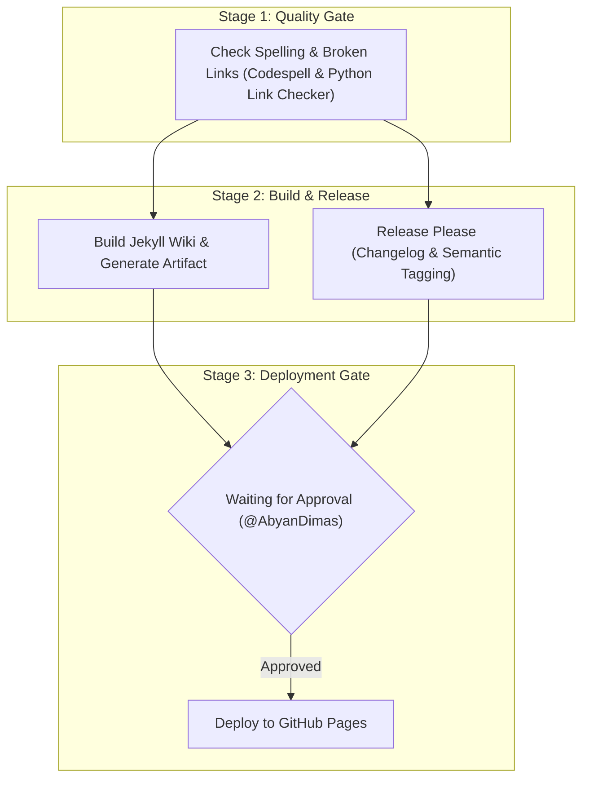

# OpenStack Research Documentation

[](https://github.com/AbyanDimas/Opentack-Research/actions/workflows/pipeline.yml)
[](https://github.com/AbyanDimas/Opentack-Research/releases)

Technical research and architectural notes on **OpenStack** deployment and operational workflows (DevStack Multi-Node Lab & Kolla-Ansible).

**Official Documentation Site:** [https://abyandimas.github.io/Opentack-Research/](https://abyandimas.github.io/Opentack-Research/)

---

## Directory Structure & Categorization

The documentation and automation assets are organized into modular domains:

```text
Opentack-Research/
├── _layouts/
│   └── default.html              # Dinky theme layout with real-time search & copy buttons
├── assets/
│   ├── css/custom.css            # Custom responsive styling and Markdown alerts
│   └── js/search.js              # Client-side instant search engine (shortcut '/')
├── docs/
│   ├── overview/
│   │   ├── architecture.md       # Topology and multi-node role split
│   │   ├── environment-setup.md  # Host preparation and local.conf specifications
│   │   └── devstack-lab-notes.md # Real-world lessons from constrained hardware
│   ├── core-services/
│   │   ├── keystone.md           # Identity service and Fernet tokens
│   │   ├── nova-placement.md     # Compute orchestration and Placement API
│   │   ├── neutron-ovn.md        # Software-defined networking with OVN
│   │   └── storage.md            # Glance image registry and Cinder block storage
│   └── operations/
│       ├── troubleshooting.md    # OOM prevention, AMQP tuning, OVN DB sync
│       └── kolla-ansible.md      # Containerized multi-node deployment
├── labs/
│   ├── devstack/
│   │   ├── bootstrap.sh          # One-liner system setup & user preparation
│   │   └── local.conf            # Low-memory local.conf configuration template
│   └── README.md                 # Lab provisioning quickstart
├── scripts/
│   └── check-links.py            # Internal Markdown link validator
└── .github/
    ├── workflows/pipeline.yml    # Unified CI/CD Pipeline (Lint, Build, Release, Deploy)
    └── pull_request_template.md  # Standardized Pull Request template
```

---

## CI/CD Pipeline Architecture

All updates are governed by a single unified GitHub Actions pipeline:



- **Branch Protection:** Default branch is `pages` and requires Pull Requests for changes.
- **Automated Releases:** Semantic versioning and changelog tracking powered by Google Release Please.
- **Deployment Gate:** Production deployments pause in the `github-pages` environment until explicitly approved.
