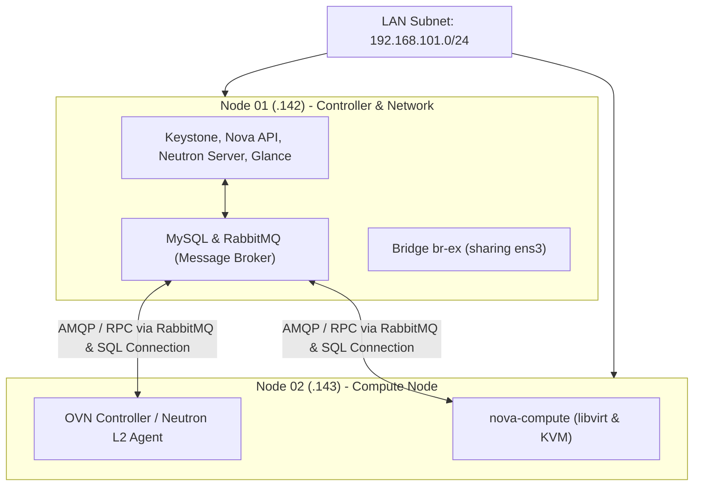

# 🏗️ Arsitektur & Lab DevStack

Dokumen ini membedah arsitektur eksperimen **DevStack Multi-Node** yang dibangun di atas perangkat homelab dengan spesifikasi terbatas: **dua mesin virtual (VM) Ubuntu 24.04 LTS masing-masing hanya memiliki 4GB RAM dan 60GB disk**.

---

## 🎯 Rasionalisasi dan Latar Belakang

Kebanyakan tutorial OpenStack mengasumsikan ketersediaan server berkapasitas besar (minimal 16GB–32GB RAM per node). Namun, membangun lab pada lingkungan dengan memori terbatas (4GB) justru memaksa pemahaman mendalam terhadap fungsi spesifik setiap subsistem:

> **Pelajaran Inti:**  
> Selisih antara mengeksekusi perintah `openstack server list` dengan memahami **mengapa Nova Conductor harus berkomunikasi ke RabbitMQ sebelum menyentuh database** adalah esensi penguasaan infrastruktur cloud.

---

## 🖥️ Topologi Node & Alokasi Peran

Lab disusun menggunakan 2 Node dalam satu subnet LAN fisik:

| Node | Hostname | IP Address | Peran (Role) & Layanan Utama |
|---|---|---|---|
| **Node 1** | `ab-lab-research-01` | `192.168.101.142` | **Controller & Network Node** Keystone, Nova API, Nova Conductor, Nova Scheduler, Glance, Neutron Server, MySQL, RabbitMQ, OVN Central |
| **Node 2** | `ab-lab-research-02` | `192.168.101.143` | **Compute Node** `nova-compute`, libvirt, KVM, OVN Controller (`ovn-controller`) |

---

## ⚡ Karakteristik Aliran Komunikasi

1. **Desentralisasi Eksekusi (Stateless Control):**  
   Node 2 (`compute`) tidak mengambil keputusan penjadwalan secara mandiri. Keputusan penempatan VM diambil seluruhnya di Node 1 oleh **Nova Scheduler & Placement**. Node 2 hanya mengeksekusi instruksi peluncuran instance via `libvirt` ketika diperintah.
2. **Tidak Ada Dependensi SSH Antar-Node:**  
   Seluruh sinkronisasi status dan perintah orkestrasi dikirimkan melalui antrean pesan **RabbitMQ (AMQP)** dan kueri terarah ke **MySQL**, bukan lewat remote shell.
3. **Pemisahan Peran untuk Kelangsungan Sistem (Survival Split):**  
   Dengan kapasitas memori hanya 4GB per node, menempatkan API service di kedua node akan memicu *memory exhaustion* (OOM Killer). Node 1 mendedikasikan RAM untuk seluruh *control plane*, sedangkan Node 2 mendedikasikan RAM untuk *hypervisor* dan instance pengguna.

---

## 🔌 Solusi Single NIC untuk Jaringan Eksternal

Pada instalasi standar, OpenStack memerlukan kartu jaringan terpisah untuk *management network* dan *external provider network*. Karena kedua VM homelab hanya memiliki satu interface fisik (`ens3`), arsitektur disesuaikan dengan:

- Membuat Open vSwitch bridge `br-ex` langsung menumpang di interface `ens3`.
- Mengalokasikan blok subnet kecil (misalnya `/28`) yang belum digunakan dari LAN fisik lokal untuk dijadikan **Floating IP pool**.
- Menyetel parameter `PUBLIC_INTERFACE=ens3` dan `FLOATING_RANGE` pada konfigurasi DevStack.

---

  <a class="page-nav-btn" href="{{ '/' | relative_url }}">&larr; Beranda Wiki</a>
  <a class="page-nav-btn" href="{{ '/prerequisites' | relative_url }}">Lanjut: ⚙️ Prasyarat & local.conf &rarr;</a>

