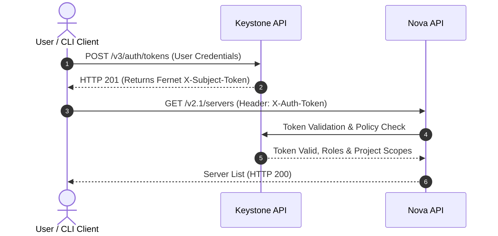

# Keystone: Identity Service Architecture

Keystone provides centralized authentication, authorization, and service discovery across the OpenStack cloud ecosystem. Every interaction with Nova, Neutron, Glance, and Cinder requires validation through Keystone.

---

## 1. Fernet Token Architecture

Legacy UUID and PKI token implementations introduced performance bottlenecks (UUID tokens required continuous database lookups; PKI tokens exceeded HTTP header limits). Modern OpenStack implementations rely on **Fernet Tokens**:

- **Characteristics:** Compact (~255 characters), symmetric AES-128-CBC encryption, authenticated with HMAC-SHA256.
- **Stateless Validation:** Keystone does not store active tokens in the MySQL database. Verification is computed cryptographically using symmetric keys located at `/etc/keystone/fernet-keys/`.
- **Key Rotation:** Tokens are rotated periodically using `keystone-manage fernet_rotate`.

---

## 2. RBAC Policy Scoping (System vs. Project)

Modern OpenStack releases enforce strict boundary scoping to prevent privilege escalation:

| Token Scope | Target Boundary | Example Capabilities |
|---|---|---|
| **System-Scoped** | Global physical infrastructure management. | Hypervisor management, global network provider binding, control-plane log inspection. |
| **Domain-Scoped** | Administrative boundaries for tenants/organizations. | User lifecycle, group membership, project quota allocations. |
| **Project-Scoped** | Tenant/project resource boundaries. | Instance creation, virtual port attachment, security group updates. |

---

## 3. Service Catalog and Service Tokens

The Keystone **Service Catalog** functions as a dynamic directory of REST API endpoints:
- **Public Endpoint:** Externally accessible by client tools and end users.
- **Internal Endpoint:** Used for high-speed inter-service communication within the management subnet.
- **Admin Endpoint:** Dedicated to privileged administrative workflows.

To prevent token expiry during long-running tasks, **Service Tokens** (`X-Service-Token`) are passed alongside user tokens (`X-Auth-Token`) when Nova communicates downstream with Glance or Neutron.

---

  <a class="page-nav-btn" href="{{ '/docs/overview/environment-setup/' | relative_url }}">&larr; Environment & Setup</a>
  <a class="page-nav-btn" href="{{ '/docs/core-services/nova-placement/' | relative_url }}">Next: Nova & Placement &rarr;</a>

