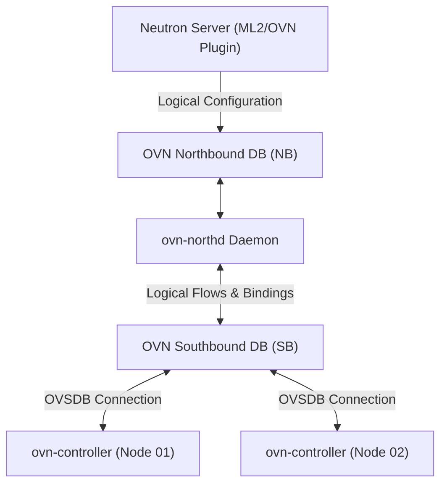

# Neutron: Software-Defined Networking with OVN

Neutron provides software-defined networking abstractions across virtual machines. In modern OpenStack releases (2024–2026), **Open Virtual Network (OVN)** serves as the standard backend mechanism driver, deprecating legacy ML2/OVS agent architectures.

---

## 1. OVN Architecture vs. Legacy ML2/OVS

Legacy OVS deployments required distinct Python daemons running on every compute host (`neutron-openvswitch-agent`, `neutron-dhcp-agent`, `neutron-l3-agent`, `neutron-metadata-agent`), creating significant memory footprint and slow flow convergence.

### OVN Advantages:
- **Agentless Execution:** A single lightweight C daemon (`ovn-controller`) runs on each node, handling L2 switching, L3 distributed routing, DHCP, and metadata natively within Open vSwitch.
- **Dual OVSDB Databases:**
  1. **Northbound Database (NB DB):** Stores high-level logical network definitions generated by Neutron.
  2. **Southbound Database (SB DB):** Translates logical configurations into physical bindings and flow targets.
- **Geneve Encapsulation:** Employs Geneve (*Generic Network Virtualization Encapsulation*), which provides extensible TLV metadata options compared to standard VXLAN.



---

## 2. Distributed Virtual Routing (DVR) & Floating IPs

With OVN, routing between tenant private networks (*east-west traffic*) is performed locally on the host where the source VM resides, eliminating centralized gateway bottlenecks.

For external connectivity (*north-south traffic*):
- Instances without floating IPs use centralized SNAT via the designated gateway chassis.
- Instances with assigned **Floating IPs** utilize distributed 1:1 NAT directly on the hypervisor hosting the VM, achieving minimum latency and optimal throughput.

---

## 3. Single NIC Physical Bridge Configuration

On nodes equipped with a single physical network interface (`ens3`), the provider bridge `br-ex` is bound directly:

```bash
# Verify Open vSwitch configuration
sudo ovs-vsctl show

# Attach physical interface ens3 to external bridge
sudo ovs-vsctl add-port br-ex ens3
```

Kernel settings required to ensure packet forwarding through the bridge:

```bash
sudo sysctl -w net.ipv4.ip_forward=1
sudo sysctl -w net.ipv4.conf.all.rp_filter=0
sudo sysctl -w net.ipv4.conf.default.rp_filter=0
```

---

<div class="page-nav-box">
  <a class="page-nav-btn" href="{{ '/docs/core-services/nova-placement/' | relative_url }}">&larr; Nova & Placement</a>
  <a class="page-nav-btn" href="{{ '/docs/core-services/storage/' | relative_url }}">Next: Glance & Cinder &rarr;</a>
</div>
