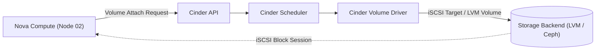

# Storage Services: Glance & Cinder

OpenStack splits persistent storage into two foundational services: **Glance** for virtual machine operating system templates (*disk images*), and **Cinder** for attachable block volumes (*persistent disks*).

---

## 1. Glance: Image Registry Architecture

Glance acts as a registry and metadata catalog for raw OS images, cloud-init templates, and ISO installers.

### Image Format Comparison: RAW vs. QCOW2

| Metric | QCOW2 | RAW |
|---|---|---|
| **Storage Efficiency** | Sparse and compressed; minimizes initial disk storage requirements. | Allocates full disk geometry immediately; larger footprint on disk. |
| **First Boot Latency** | Higher; Nova must unpack or generate an overlay during initialization. | **Lowest**; instances can clone directly via sparse copying. |
| **I/O Throughput** | Slight translation overhead during dynamic block expansion. | **Native performance**; near-zero virtualization penalty. |
| **Ceph RBD Suitability** | Non-optimal; must be converted to RAW before fast cloning. | **Required** for Ceph copy-on-write instantaneous provisioning. |

### CLI Image Upload:
```bash
# Upload a lightweight CirrOS test image
openstack image create "cirros-0.6.2" \
  --file cirros-0.6.2-x86_64-disk.img \
  --disk-format qcow2 \
  --container-format bare \
  --public
```

---

## 2. Cinder: Persistent Block Storage

Ephemeral disks provisioned via Nova are discarded upon instance deletion. Cinder manages lifecycle and attachment for block volumes that persist independently.

### Component Architecture:
1. **`cinder-api`:** Authenticates and routes volume management calls from users and Nova.
2. **`cinder-scheduler`:** Evaluates backend pools against requested size, type, IOPS capabilities, and availability zones.
3. **`cinder-volume`:** Interacts with physical storage backends via driver modules (Ceph RBD, LVM/iSCSI, NFS, SAN arrays).



---

## 3. Homelab LVM Loopback Implementation

In constrained DevStack homelab environments, Cinder storage is backed by a loopback image configured as a Linux Logical Volume Manager (LVM) volume group (`stack-volumes-default`):

```bash
# Inspect active LVM storage pools
sudo vgs
sudo lvs

# Create and attach a persistent test volume
openstack volume create --size 5 test-volume-01
openstack server add volume my-instance test-volume-01
```

---

<div class="page-nav-box">
  <a class="page-nav-btn" href="{{ '/docs/core-services/neutron-ovn/' | relative_url }}">&larr; Neutron & OVN</a>
  <a class="page-nav-btn" href="{{ '/docs/operations/troubleshooting/' | relative_url }}">Next: Troubleshooting &rarr;</a>
</div>
