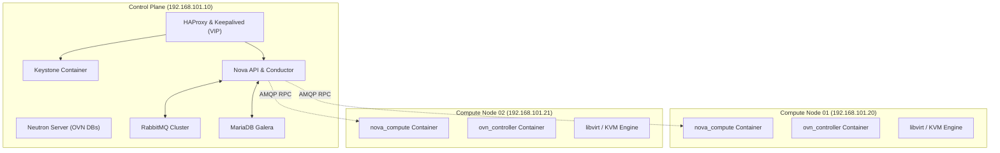

# Kolla-Ansible Multi-Node Deployment Guide

This guide covers deploying production-grade containerized OpenStack using **Kolla-Ansible**. While DevStack serves as an excellent environment for single-node development and code debugging, Kolla-Ansible packages every OpenStack service into containerized microservices managed by Docker/Podman and orchestrated via Ansible.

---

## DevStack vs. Kolla-Ansible: Architectural Comparison

| Dimension | DevStack | Kolla-Ansible |
|---|---|---|
| **Target Audience** | OpenStack core developers & isolated feature testing | Production clusters, staging labs, and operators |
| **Execution Model** | Native systemd daemons in Python virtual environments | Containerized microservices (Docker / Podman) |
| **Upgrade Strategy** | Non-trivial; requires wiping and re-stacking | Rolling container image updates with minimal downtime |
| **High Availability** | Single-node (or basic two-node manual dev setup) | Native HA with Keepalived, HAProxy, and MariaDB Galera |
| **Configuration Model** | Single monolithic `local.conf` | Structured YAML in `/etc/kolla/globals.yml` & role overrides |

> [!NOTE]
> In Kolla-Ansible, each daemon runs in its own isolated container (e.g., `nova_api`, `nova_conductor`, `neutron_server`). Service configurations are generated from Jinja2 templates and bind-mounted from `/etc/kolla/<service_name>/`.

---

## Lab Architecture & Inventory

A standard multi-node Kolla-Ansible topology segregates control plane services from compute hypervisors:



### Ansible Inventory (`multinode`)

```ini
[control]
control01 ansible_host=192.168.101.10 ansible_user=ubuntu

[network:children]
control

[compute]
compute01 ansible_host=192.168.101.20 ansible_user=ubuntu
compute02 ansible_host=192.168.101.21 ansible_user=ubuntu

[storage:children]
control

[monitoring:children]
control

[deployment]
localhost ansible_connection=local
```

---

## Core Configuration (`/etc/kolla/globals.yml`)

The `/etc/kolla/globals.yml` file is the primary specification for your cloud:

```yaml
---
# OpenStack Release Series (e.g., 2024.1 Caracal or 2024.2 Dalmatian)
openstack_release: "2024.1"

# Base container operating system
kolla_base_distro: "ubuntu"
kolla_install_type: "source"

# Network Interfaces
network_interface: "ens3"                # Management and internal API network
neutron_external_interface: "ens4"       # External / provider bridge interface
kolla_internal_vip_address: "192.168.101.250" # High Availability Virtual IP

# Neutron Network Mechanism
neutron_plugin_agent: "ovn"
neutron_ovn_distributed_floating_ip: "yes"

# Service Enablement
enable_openstack_core: "yes"
enable_horizon: "yes"
enable_cinder: "yes"
enable_cinder_backend_lvm: "yes"
enable_central_logging: "no"
```

> [!WARNING]
> Ensure that `kolla_internal_vip_address` does not conflict with existing DHCP leases or static IPs on your management subnet. Keepalived will bind this VIP via VRRP.

---

## Deployment Lifecycle

Follow these sequential stages when executing the deployment from the deployment operator host:

### 1. Host Preparation & Bootstrap
Prepares Docker daemon, Python dependencies, and system user privileges across all inventory hosts:

```bash
kolla-ansible -i multinode bootstrap-servers
```

### 2. Pre-Deployment Validation
Verifies host ports, network bridges, disk space, and kernel parameters to avoid midway failures:

```bash
kolla-ansible -i multinode prechecks
```

### 3. Service Deployment
Pulls container images and instantiates all control plane and compute containers:

```bash
kolla-ansible -i multinode deploy
```

### 4. Post-Deployment Credential Generation
Generates the administrative environment script `admin-openrc.sh` and internal passwords in `/etc/kolla/`:

```bash
kolla-ansible -i multinode post-deploy
```

To interact with the new cloud, source the generated credentials:

```bash
source /etc/kolla/admin-openrc.sh
openstack endpoint list
openstack hypervisor list
```

---

## Operational Diagnostics

When maintaining a containerized OpenStack cluster:

```bash
# Check status of all Kolla containers on a node
docker ps --format "table {{.Names}}\t{{.Status}}\t{{.Image}}"

# Tail live logs for a specific service daemon
docker logs -f nova_compute

# Execute commands inside a container
docker exec -it nova_compute bash

# Inspect mounted configuration files
cat /etc/kolla/nova-compute/nova.conf
```

---

<div class="page-nav-box">
  <a href="/docs/operations/troubleshooting/" class="page-nav-btn">← Troubleshooting & Diagnostics</a>
  <a href="/labs/" class="page-nav-btn">Lab Scripts & Configs →</a>
</div>
