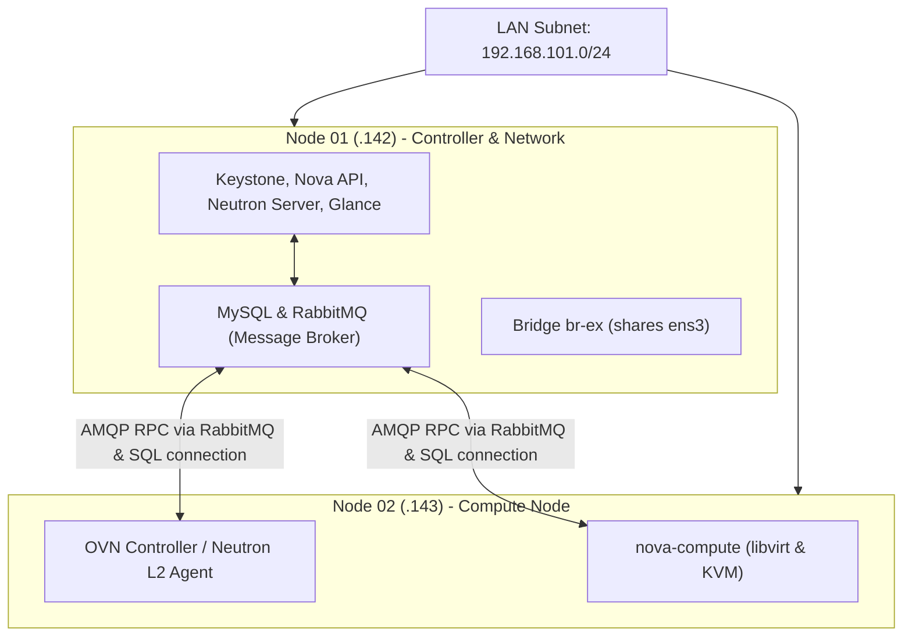

# OpenStack DevStack Architecture & Lab Topology

This document provides a detailed breakdown of the multi-node **DevStack** lab environment built on constrained hardware: **two Ubuntu 24.04 LTS virtual machines, each provisioned with 4GB RAM and 60GB disk space**.

---

## Lab Constraints and Rationale

Most OpenStack deployment guides assume servers with at least 16GB–32GB RAM per node. Operating a multi-node cluster under strict resource limits (4GB per VM) forces an explicit understanding of each daemon's resource consumption and interaction patterns.

> **Operational Insight:**  
> The architectural difference between executing `openstack server list` and understanding why Nova Conductor dispatches an RPC message via RabbitMQ before querying MySQL represents the core mechanism of OpenStack orchestration.

---

## Node Topology and Role Allocation

The lab is configured across two nodes within the same physical LAN subnet:

| Node | Hostname | IP Address | Assigned Roles and Daemons |
|---|---|---|---|
| **Node 1** | `ab-lab-research-01` | `192.168.101.142` | **Controller & Network Node** Keystone, Nova API, Nova Conductor, Nova Scheduler, Glance, Neutron Server, MySQL, RabbitMQ, OVN Central |
| **Node 2** | `ab-lab-research-02` | `192.168.101.143` | **Compute Node** `nova-compute`, libvirt, KVM, OVN Controller (`ovn-controller`) |

---

## Communication and Control Flow

1. **Stateless Compute Execution:**  
   Node 2 does not perform independent scheduling or network planning. Scheduling decisions are executed entirely on Node 1 via Nova Scheduler and the Placement API. Node 2 operates as an execution target, provisioning KVM instances through libvirt and wiring virtual interfaces upon instruction.
2. **Elimination of Inter-Node SSH:**  
   No SSH connections are used between the controller and compute nodes during instance provisioning. All coordination occurs asynchronously via **RabbitMQ (AMQP)** and direct **MySQL** database connections using service credentials.
3. **Control Plane Isolation:**  
   To prevent Out-Of-Memory (OOM) termination on 4GB nodes, all API and database services are strictly consolidated onto Node 1, leaving Node 2 dedicated to hypervisor processes and user instances.

---

## Single NIC External Network Configuration

Standard OpenStack topologies require dedicated physical network interfaces for management traffic and provider networks. To operate with a single physical NIC (`ens3`), the external Open vSwitch bridge `br-ex` shares the interface:

- The `br-ex` bridge is attached directly to `ens3`.
- A dedicated `/28` address block from the local LAN subnet is assigned to the OpenStack Floating IP pool.
- The DevStack configuration sets `PUBLIC_INTERFACE=ens3` and maps `FLOATING_RANGE` directly onto the unused host subnet block.

---

  <a class="page-nav-btn" href="{{ '/' | relative_url }}">&larr; Introduction</a>
  <a class="page-nav-btn" href="{{ '/docs/overview/environment-setup/' | relative_url }}">Next: Environment & Setup &rarr;</a>

