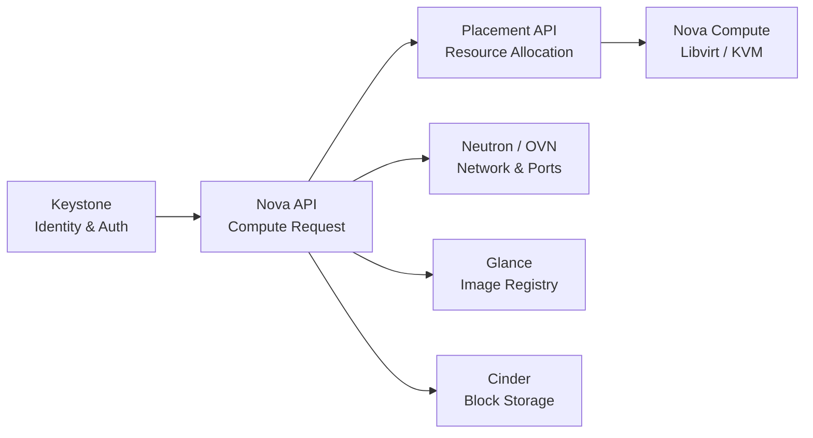

# OpenStack Research Documentation

This repository provides technical research and operational documentation for **OpenStack**, focused on private cloud architecture, multi-node lab implementation under strict hardware constraints (DevStack on dual 4GB RAM virtual machines), and modern OpenStack subsystems (covering releases **2025.1 Epoxy, 2025.2 Flamingo, and 2026.1 Gazpacho**).

---

## Documentation Index

The research documentation is structured into modular sections covering system architecture, deployment, core cloud services, and operational troubleshooting:

| Category | Module | Core Scope |
|---|---|---|
| **Overview** | [Architecture & Topology](./docs/overview/architecture/) | Multi-node topology, control-plane vs compute role split, and AMQP/SQL RPC communication flow. |
| **Overview** | [Environment & Setup](./docs/overview/environment-setup/) | Ubuntu 24.04 LTS preparation, 8GB swap sizing, stack user permissions, and dual `local.conf` specifications. |
| **Overview** | [DevStack Practical Notes](./docs/overview/devstack-lab-notes/) | Lessons learned from real-world homelab execution on constrained hardware. |
| **Core Services** | [Keystone Architecture](./docs/core-services/keystone/) | Fernet token format, key rotation, system-scoped vs project-scoped RBAC, and service tokens. |
| **Core Services** | [Nova & Placement API](./docs/core-services/nova-placement/) | Instance boot workflow, scheduler filter and weigh algorithms, and Placement resource provider modeling. |
| **Core Services** | [Neutron & OVN](./docs/core-services/neutron-ovn/) | Modern OVN software-defined networking, Geneve encapsulation, distributed routing, and single-NIC bridge topology. |
| **Core Services** | [Glance & Cinder Storage](./docs/core-services/storage/) | Disk image formats (RAW vs QCOW2), block storage lifecycle, and LVM loopback driver implementation. |
| **Operations** | [Troubleshooting & Diagnostics](./docs/operations/troubleshooting/) | Out-Of-Memory prevention, AMQP heartbeat tuning, systemd user service management, and OVN database synchronization. |

---

## Recent OpenStack Releases (2025–2026)

OpenStack maintains a six-month release cadence consisting of SLURP (Support Long Term Upgrade Release Process) and non-SLURP cycles:

- **Epoxy (2025.1) & Flamingo (2025.2):** Full standardization of OVN as the default networking mechanism; enhanced system-scoped token enforcement for administrative APIs.
- **Gazpacho (2026.1):** Optimized Placement API query latency for specialized hardware traits and reduced idle memory footprint across Python control-plane daemons.

---

  
  <a class="page-nav-btn" href="{{ '/docs/overview/architecture/' | relative_url }}">Next: Architecture & Topology &rarr;</a>

