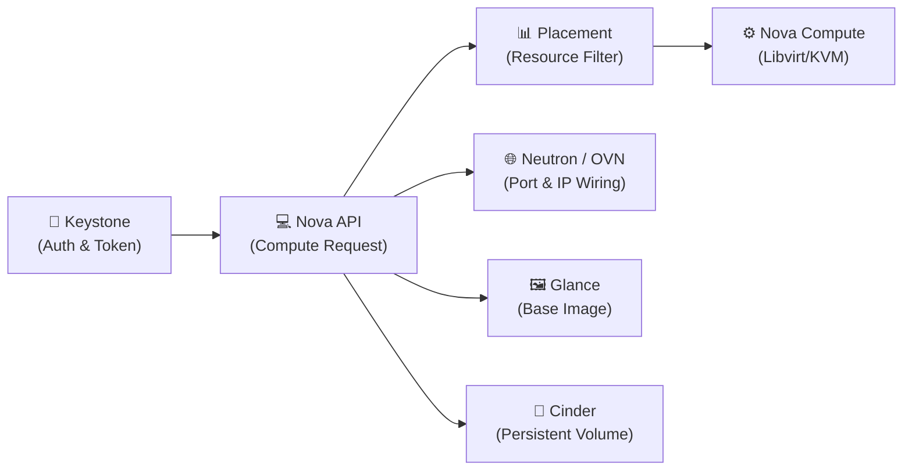

# 🚀 OpenStack Research Wiki

Selamat datang di repositori riset dan dokumentasi teknis **OpenStack**. Dokumentasi ini menyajikan eksplorasi mendalam arsitektur komputasi awan *private cloud*, implementasi lab nyata pada lingkungan *constrained hardware* (DevStack 2-Node pada RAM 4GB), serta analisis komponen OpenStack modern (rilis terkini **2025/2026: Epoxy, Flamingo, Gazpacho**).

---

## 🧭 Peta Navigasi Dokumentasi

Dokumentasi ini dirancang agar saling terhubung secara runtut dari konsep dasar hingga implementasi:

| Bagian | Dokumen | Penjelasan Utama |
|---|---|---|
| **01. Lab Overview** | [**Arsitektur & Lab DevStack**](./architecture) | Topologi multi-node, rasionalisasi pembagian peran, dan RPC data flow. |
| **02. Setup Guide** | [**Prasyarat & Setup local.conf**](./prerequisites) | Konfigurasi Ubuntu 24.04, swap sizing, `stack` user, dan file `local.conf`. |
| **03. Identity** | [**Keystone Identity Service**](./keystone) | Fernet tokens, token scoping (system vs project), dan service catalog. |
| **04. Compute** | [**Nova & Placement API**](./nova-placement) | Instance boot lifecycle, scheduler weighting, dan alokasi resource provider. |
| **05. Network** | [**Neutron & OVN Architecture**](./neutron-ovn) | Evolusi OVN vs legacy OVS, Geneve overlay, distributed routing, dan single NIC. |
| **06. Storage** | [**Glance & Cinder Storage**](./storage-glance-cinder) | Image management (RAW vs QCOW2), block volume lifecycle, dan Ceph/LVM backend. |
| **07. Problem Solving**| [**Troubleshooting & Lab Learnings**](./troubleshooting) | Solusi OOM, RabbitMQ disconnect, debug systemd, dan OVN DB sync. |

---

## 🌐 Perkembangan OpenStack Terkini (Rilis 2025–2026)

OpenStack terus berevolusi dengan siklus rilis 6 bulan (*SLURP & Non-SLURP*):

- **Epoxy (2025.1) & Flamingo (2025.2):** Standardisasi penuh backend **OVN** menggantikan agen-agen OVS legacy; penguatan isolasi RBAC berbasis *system-scoped tokens*.
- **Gazpacho (2026.1):** Peningkatan performa Placement API untuk akselerator hardware (GPU/vGPU) dan optimasi footprint memori pada modul control plane.

---

  
  <a class="page-nav-btn" href="{{ '/architecture' | relative_url }}">Mulai Baca: 🏗️ Arsitektur & Lab &rarr;</a>

