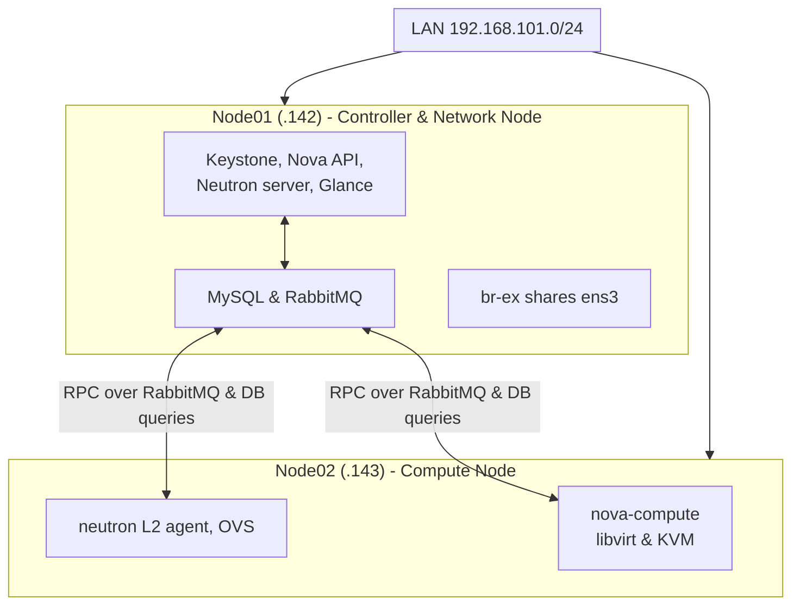

# OpenStack Research Wiki

Selamat datang di repositori riset dan dokumentasi **OpenStack**. Repositori ini berisi kumpulan catatan arsitektur, eksperimen homelab, konfigurasi DevStack, serta panduan implementasi cloud privat multi-node.

---

## 📚 Daftar Isi / Navigasi Dokumen

- [**Arsitektur & DevStack Lab Overview**](./OpenStack-DevStack-Overview)
  - Arsitektur Lab Multi-node (Controller + Compute)
  - Penjelasan Alur Komunikasi (Nova, Neutron, Keystone, Glance, RabbitMQ, MySQL)
  - Konfigurasi Single NIC dengan Bridge `br-ex`

---

## 🏗️ Ringkasan Topologi Lab

Topologi eksperimen menggunakan dua node Ubuntu 24.04 LTS dengan alokasi memori minimalis (4GB RAM per node):

| Node | Hostname | IP | Peran (Role) |
|---|---|---|---|
| **Node 1** | `ab-lab-research-01` | `192.168.101.142` | Controller & Network Node (Keystone, Nova API, Neutron Server, Glance, MySQL, RabbitMQ) |
| **Node 2** | `ab-lab-research-02` | `192.168.101.143` | Compute Node (`nova-compute`, libvirt, KVM, Neutron L2 Agent / OVS) |

---

## 💡 Pelajaran Utama dari Lab

1. **Resource Headroom & Split Peran:**
   Menjalankan OpenStack di 4GB RAM memerlukan pemisahan ketat: Node 1 menampung seluruh *control plane*, sementara Node 2 hanya menjalankan *compute agent*.
2. **Ketiadaan Dedicated NIC:**
   External network di-share langsung di atas interface fisik yang sama (`ens3`) dengan mengarahkan `br-ex`, `FLOATING_RANGE`, dan `PUBLIC_INTERFACE` ke subnet lokal.

---

