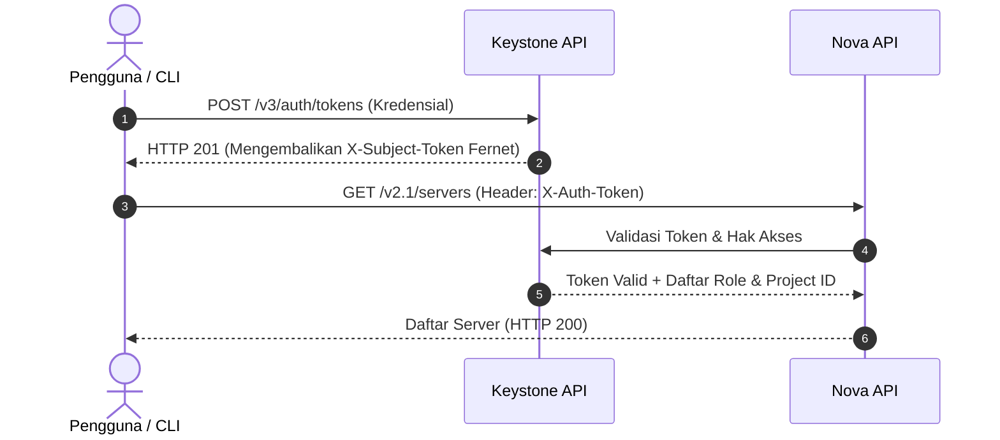

# 🔐 Keystone: OpenStack Identity Service

Keystone adalah gerbang autentikasi dan otorisasi sentral bagi seluruh ekosistem OpenStack. Tanpa Keystone, tidak ada layanan lain (Nova, Neutron, Glance, Cinder) yang dapat memverifikasi identitas pengguna maupun saling berkomunikasi secara terpercaya.

---

## 1. Arsitektur Fernet Tokens

Pada era awal OpenStack, token UUID dan PKI digunakan namun menimbulkan masalah skalabilitas (UUID membutuhkan validasi database terus-menerus, sedangkan PKI menghasilkan token raksasa yang melampaui limit header HTTP).

OpenStack modern menggunakan **Fernet Tokens**:
- **Karakteristik:** Token berukuran kecil (~255 karakter), terenkripsi simetris (AES-128-CBC) dan diautentikasi dengan HMAC-SHA256.
- **Tanpa Persistensi Database:** Keystone tidak perlu menyimpan setiap token yang aktif di tabel MySQL. Validasi token dilakukan secara komputasi matematika menggunakan kunci simetris (*Fernet keys*).
- **Rotasi Kunci:** Kunci disimpan di `/etc/keystone/fernet-keys/`. Kunci diputar secara periodik via `keystone-manage fernet_rotate`.

---

## 2. Model Otorisasi RBAC Modern (Scoping)

Mulai rilis OpenStack kontemporer (2024–2026), model kebijakan disempurnakan dengan pemisahan lingkup token (*token scope*):

| Jenis Scope | Tujuan | Contoh Operasi |
|---|---|---|
| **System-Scoped** | Mengatur resource level infrastruktur fisik global. | Menambah hypervisor, memeriksa log antrean, mengelola physical network. |
| **Domain-Scoped** | Delegasi administratif pada tingkat tenant/organisasi induk. | Mengelola user, group, dan alokasi kuota project dalam satu domain. |
| **Project-Scoped** | Operasi sehari-hari di tingkat project / virtual tenant. | Meluncurkan VM, membuat port jaringan internal, membuat snapshot volume. |

---

## 3. Service Catalog & Service Tokens

Keystone menyediakan **Service Catalog** yang berfungsi sebagai buku alamat dinamis untuk menemukan endpoint REST API layanan:
- **Public Endpoint:** Dapat diakses oleh pengguna luar (biasanya via load balancer atau domain publik).
- **Internal Endpoint:** Jalur komunikasi cepat dan privat antar-layanan di subnet manajemen.
- **Admin Endpoint:** Digunakan khusus untuk operasi sensitif.

Untuk mencegah serangan manipulasi token kedaluwarsa saat transaksi berdurasi panjang, OpenStack mengimplementasikan **Service Tokens**:
Layanan (seperti Nova) menyertakan identitas layanannya sendiri (`X-Service-Token`) di samping token pengguna (`X-Auth-Token`) saat memanggil Glance atau Neutron.

---

  <a class="page-nav-btn" href="{{ '/prerequisites' | relative_url }}">&larr; Setup & local.conf</a>
  <a class="page-nav-btn" href="{{ '/nova-placement' | relative_url }}">Lanjut: 💻 Nova & Placement &rarr;</a>

