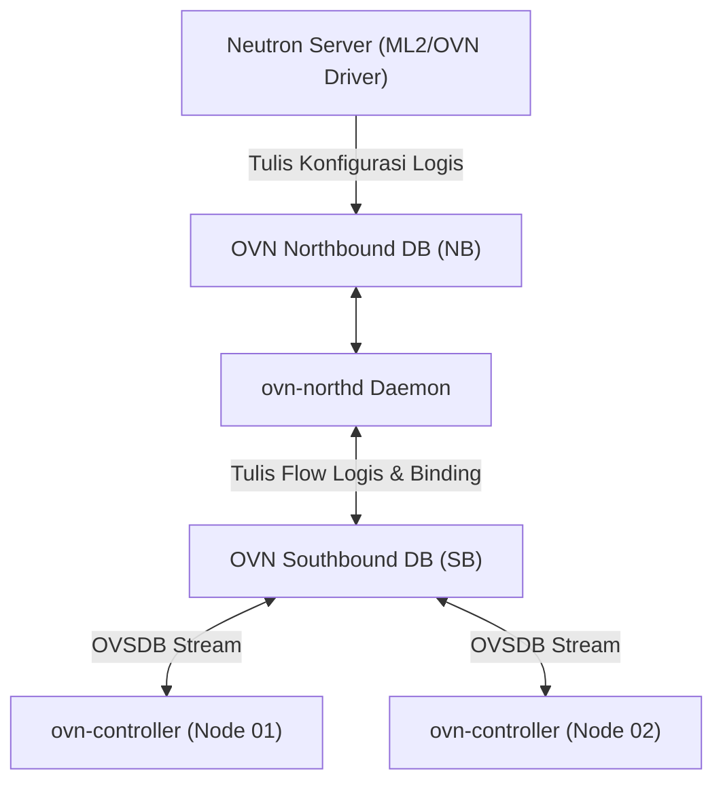

# 🌐 Neutron: Software-Defined Networking & OVN

Neutron menyediakan abstraksi jaringan tervirtualisasi (*virtual networks, subnets, routers, floating IPs, and security groups*). Pada rilis modern OpenStack (2024–2026), **Open Virtual Network (OVN)** telah resmi menjadi backend standar default menggantikan arsitektur agen ML2/OVS konvensional.

---

## 1. Evolusi OVN vs Legacy ML2/OVS

Pada arsitektur OVS klasik, setiap host harus menjalankan banyak agen terpisah (`neutron-openvswitch-agent`, `neutron-dhcp-agent`, `neutron-l3-agent`, `neutron-metadata-agent`). Kompleksitas ini menimbulkan *overhead* memori yang besar dan keterlambatan propagasi flow table.

### Keunggulan OVN:
- **Arsitektur Tanpa Agen Terpisah:** Seluruh fungsi L2, L3 (routing), DHCP, dan metadata ditangani secara terdistribusi oleh `ovn-controller` di setiap node.
- **Database Terdistribusi:** OVN menggunakan dua database sentral berbasis OVSDB:
  1. **Northbound Database (NB DB):** Menyimpan model jaringan logis dari Neutron.
  2. **Southbound Database (SB DB):** Mengonversi model logis menjadi representasi flow fisik dan binding port hypervisor.
- **Geneve Enkapsulasi:** Menggunakan protokol Geneve (*Generic Network Virtualization Encapsulation*) yang lebih fleksibel dan kaya metadata dibandingkan VXLAN klasik.



---

## 2. Distributed Virtual Routing (DVR) & Floating IPs

Pada setup OVN, routing antar-subnet tenant (*east-west traffic*) terjadi langsung di hypervisor lokal tanpa perlu memantul ke network node sentral.

Untuk *north-south traffic* (menuju internet/jaringan eksternal):
- Instance tanpa Floating IP menggunakan *centralized SNAT* melalui gateway router.
- Instance dengan **Floating IP** menggunakan *distributed DNAT/SNAT* langsung dari compute node yang menampung VM tersebut.

---

## 3. Implementasi Single NIC Homelab (`br-ex` sharing `ens3`)

Karena kedua node lab hanya memiliki 1 interface fisik (`ens3`), integrasi jaringan provider dilakukan dengan menambatkan Open vSwitch bridge `br-ex` ke interface tersebut:

```bash
# Struktur binding OVS
sudo ovs-vsctl show
# Menghubungkan ens3 ke br-ex
sudo ovs-vsctl add-port br-ex ens3
```

Konfigurasi kernel Linux yang wajib diaktifkan agar paket traffic jaringan tenant dapat diteruskan (*forwarded*) melintasi bridge:

```bash
sudo sysctl -w net.ipv4.ip_forward=1
sudo sysctl -w net.ipv4.conf.all.rp_filter=0
sudo sysctl -w net.ipv4.conf.default.rp_filter=0
```

---

<div class="page-nav-box">
  <a class="page-nav-btn" href="{{ '/nova-placement' | relative_url }}">&larr; Nova & Placement</a>
  <a class="page-nav-btn" href="{{ '/storage-glance-cinder' | relative_url }}">Lanjut: 💾 Glance & Cinder &rarr;</a>
</div>
