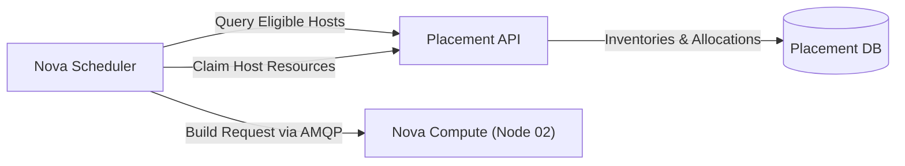

# Nova: Compute Orchestration & Placement API

Nova orchestrates the full lifecycle of compute instances, managing scheduling, provisioning, resizing, and teardown across hypervisor nodes.

---

## 1. Placement API and Inventory Modeling

The Placement API tracks inventory and allocations for compute resources, preventing race conditions and eliminating the need for Nova Scheduler to poll hypervisors directly.

Core Placement abstractions:
- **Resource Provider (RP):** An entity that provides compute or storage capacity (e.g., hypervisor host `ab-lab-research-02`).
- **Inventory:** Quantitative capacity of an RP for specific classes (`VCPU`, `MEMORY_MB`, `DISK_GB`).
- **Traits:** Qualitative capabilities associated with an RP (e.g., `HW_CPU_X86_AVX2`, `CUSTOM_NVME`).
- **Allocations:** Reserved and consumed resources attributed to active instances.



---

## 2. Instance Boot Lifecycle

When an operator executes `openstack server create`, the following coordination sequence takes place:

1. **Nova API:** Authenticates the request via Keystone, validates quota and parameters, and creates a database record in state `BUILDING`.
2. **Nova Conductor:** Orchestrates scheduling requests without exposing compute hosts directly to the primary database.
3. **Nova Scheduler & Placement:**
   - Queries Placement for Resource Providers satisfying minimum flavor requirements.
   - Evaluates eligible hosts using configurable weighers (e.g., RAM weigher, CPU weigher).
4. **RabbitMQ RPC:** Nova Conductor dispatches an AMQP cast message to `nova-compute` on the selected host (Node 2).
5. **Neutron & Glance Integration:**
   - `nova-compute` requests virtual port and IP allocation from Neutron.
   - `nova-compute` pulls the base disk image from Glance into the host base cache (`/opt/stack/data/nova/instances/_base`).
6. **Libvirt Driver:** Generates libvirt domain XML and launches the KVM process.

---

## 3. Memory Allocation Tuning for 4GB Homelab

On nodes with limited physical memory, overcommit parameters in `nova.conf` must be constrained to prevent kernel OOM intervention:

```ini
[DEFAULT]
cpu_allocation_ratio = 4.0
ram_allocation_ratio = 1.0
reserved_host_memory_mb = 1024
```

> **Operational Standard:**  
> Maintaining `ram_allocation_ratio = 1.0` prevents virtual machine processes from over-allocating physical memory, guaranteeing sufficient buffer space for system daemons and Open vSwitch flows.

---

<div class="page-nav-box">
  <a class="page-nav-btn" href="{{ '/keystone' | relative_url }}">&larr; Keystone (Identity)</a>
  <a class="page-nav-btn" href="{{ '/neutron-ovn' | relative_url }}">Next: Neutron & OVN &rarr;</a>
</div>
