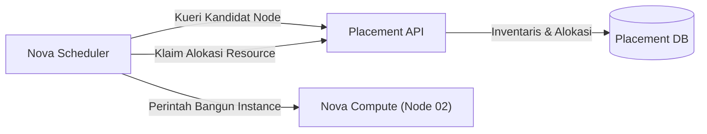

# 💻 Nova: Compute Service & Placement API

Nova bertanggung jawab atas orkestrasi siklus hidup mesin virtual (VM), mulai dari penjadwalan, peluncuran, pengubahan ukuran (*resizing*), hingga terminasi.

---

## 1. Peran Penting Placement API

Sebelum Placement dipisahkan, Nova Scheduler harus melakukan kueri database yang lambat dan rentan *race condition* untuk melacak kapasitas CPU, RAM, dan disk pada setiap hypervisor.

**Placement API** memisahkan pelacakan inventaris komputasi menjadi model abstrak:
- **Resource Provider (RP):** Objek fisik atau logis yang menyediakan kapasitas (misalnya: hypervisor node `ab-lab-research-02`).
- **Inventory:** Jumlah total kapasitas yang dimiliki RP untuk kelas sumber daya tertentu (`VCPU`, `MEMORY_MB`, `DISK_GB`).
- **Traits:** Karakteristik kualitatif yang dimiliki RP (contoh: arsitektur `HW_CPU_X86_AVX2`, dukungan `CUSTOM_NVME`).
- **Allocations:** Sumber daya yang telah direservasi dan terpakai oleh sebuah instance.



---

## 2. Alur Peluncuran Instance (*Instance Boot Flow*)

Saat pengguna mengeksekusi `openstack server create`, alur komunikasi terjadi sebagai berikut:

1. **Nova API:** Menerima permintaan, memvalidasi kuota dan skema data, mengonversi nama flavor/image menjadi UUID.
2. **Nova Conductor:** Bertindak sebagai jembatan orkestrasi independen dan database proxy agar `nova-compute` tidak perlu mengakses database utama secara langsung.
3. **Nova Scheduler & Placement:**
   - Scheduler meminta daftar Resource Provider yang memenuhi syarat minimal flavor ke Placement API.
   - Placement memfilter node yang memiliki sisa `VCPU` dan `MEMORY_MB` yang cukup.
   - Scheduler melakukan pembobotan (*weighing*) untuk memilih node terbaik.
4. **RabbitMQ RPC:** Nova Conductor mengirimkan pesan RPC ke antrean `nova-compute` di Node target (Node 2).
5. **Neutron & Glance Interaction:**
   - `nova-compute` meminta Neutron mengalokasikan virtual port dan IP address.
   - `nova-compute` mengunduh image dari Glance ke direktori *instance cache* (`/opt/stack/data/nova/instances/_base`).
6. **Hypervisor Driver (libvirt / KVM):** Mengompilasi XML domain libvirt dan meluncurkan VM menggunakan KVM/QEMU.

---

## 3. Homelab Tuning untuk Node 4GB

Pada homelab dengan RAM terbatas, overcommit ratio pada `nova.conf` perlu diperhatikan:

```ini
[DEFAULT]
cpu_allocation_ratio = 4.0
ram_allocation_ratio = 1.0
reserved_host_memory_mb = 1024
```

> **Catatan Operasional:**  
> `ram_allocation_ratio` disetel ke `1.0` (tanpa overcommit) untuk mencegah Linux OOM Killer mematikan proses KVM atau MySQL saat instance pengguna aktif.

---

<div class="page-nav-box">
  <a class="page-nav-btn" href="{{ '/keystone' | relative_url }}">&larr; Keystone (Identity)</a>
  <a class="page-nav-btn" href="{{ '/neutron-ovn' | relative_url }}">Lanjut: 🌐 Neutron & OVN &rarr;</a>
</div>
