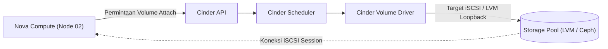

# 💾 Storage: Glance (Images) & Cinder (Block Storage)

Penyimpanan di OpenStack terbagi ke dalam dua domain utama: **Glance** untuk repositori cetak biru sistem operasi (*disk images*) dan **Cinder** untuk media penyimpanan blok persisten yang dapat dipasang (*attached*) ke instans komputasi.

---

## 1. Glance: Image Service

Glance bertindak sebagai katalog dan *registry* file ISO/QCOW2/RAW yang digunakan untuk *booting* virtual machine.

### Perbandingan Format Image: RAW vs QCOW2

| Parameter | QCOW2 | RAW |
|---|---|---|
| **Ukuran File di Disk** | Kecil (*sparse & compressed*), hemat ruang penyimpanan awal. | Besar (sesuai ukuran disk penuh yang dialokasikan). |
| **Kecepatan Boot Pertama** | Relatif lebih lambat karena Nova harus mengonversi atau membuat copy-on-write overlay. | **Sangat cepat**, Nova dapat langsung membuat instans instan melalui sparse copy. |
| **Kinerja I/O** | Sedikit *overhead* translasi sektor dinamis. | **Performa native terbaik** mendekati bare-metal I/O. |
| **Rekomendasi Ceph RBD** | Kurang optimal (harus dikonversi ke RAW sebelum kloning). | **Wajib untuk fitur instant copy-on-write Ceph.** |

### Upload Image Minimalis (CirrOS / Ubuntu Cloud Image):
```bash
# Upload CirrOS Image untuk pengujian hemat memori
openstack image create "cirros-0.6.2" \
  --file cirros-0.6.2-x86_64-disk.img \
  --disk-format qcow2 \
  --container-format bare \
  --public
```

---

## 2. Cinder: Persistent Block Storage

Instance VM yang di-*boot* langsung dari Glance ephemeral disk akan kehilangan datanya saat VM dihancurkan (*terminated*). Cinder menyediakan volume blok persisten yang bertahan melampaui siklus hidup instans.

### Arsitektur Komponen Cinder:
1. **`cinder-api`:** Titik kontak REST API untuk pengguna dan Nova.
2. **`cinder-scheduler`:** Memilih storage backend atau pool penyimpanan terbaik berdasarkan kuota, IOPS, dan kapasitas kosong.
3. **`cinder-volume`:** Agen pengelola backend penyimpanan spesifik melalui driver vendor (LVM, Ceph RBD, NetApp, Dell EMC).



---

## 3. Homelab Cinder dengan LVM Loopback Driver

Pada setup DevStack homelab 2-node, penyimpanan Cinder disimulasikan menggunakan loopback image file yang diformat sebagai Linux LVM Volume Group (`stack-volumes-default`):

```bash
# Memeriksa volume group aktif di Node 1
sudo vgs
sudo lvs

# Membuat volume blok baru via CLI
openstack volume create --size 5 test-volume-01
openstack server add volume my-instance test-volume-01
```

---

<div class="page-nav-box">
  <a class="page-nav-btn" href="{{ '/neutron-ovn' | relative_url }}">&larr; Neutron & OVN</a>
  <a class="page-nav-btn" href="{{ '/troubleshooting' | relative_url }}">Lanjut: 🔧 Troubleshooting Lab &rarr;</a>
</div>
